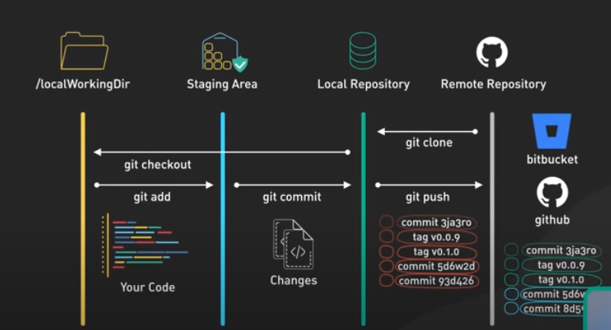
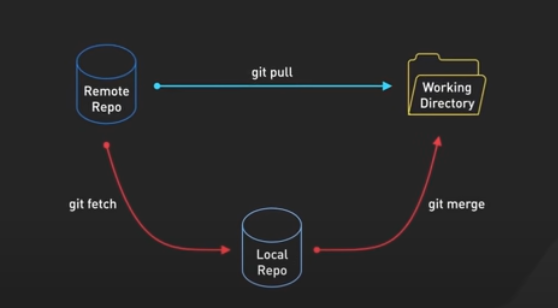

# Git

- https://www.datacamp.com/blog/git-interview-questions-and-answers
- https://www.youtube.com/watch?v=e9lnsKot_SQ&t=75s
- https://git-scm.com/docs/git-branch

## Four locations

1. Working Directory - your local development environment where you make changes to your code
2. Staging Area
3. Local Repository
4. Remote Repository



## git clone

- From an existing Remote repository to Local Repository
- Clone a repository into a new directory
- https://git-scm.com/docs/git-clone

## git add

- Save files from Workind Directory to Staging Area to prepare the next commit snapshot.
- prepares them for staging.
- https://git-scm.com/docs/git-add

## git commit

- Save changes from Staging area to Local Repo with a short comment.
- take a snapshot of the staging area and saves it to your local repo.
- Each commit creates **a unique identifier**. `* 63095ec (HEAD -> test1) first commit`
- https://git-scm.com/docs/git-commit
- Record changes to the repository

```js
git log ---graph --oneline
hiroko@owners-MBP Git % git log --graph --oneline
* 63095ec (HEAD -> test1) first commit
* 7a4d8ee (test3, test2, master) first commit
hiroko@owners-MBP Git %
```

## git pull

- To integrate your teammates's work, you use git pull which fetches changes from remote repository and merges them into your local repo.
- https://git-scm.com/docs/git-pull
- Fetch from and integrate with another repository or a local branch
- From remote repo to local repo



<hr />

## 10. What is the difference between git fetch and git pull?

**git fetch:**

- The git fetch command retrieves changes from a remote repository to the local repository.
- but it does not update the working directory or merge any changes into the current branch.
- This means that after fetching, you can review the changes made in the remote repository without affecting your local work.

**git pull**

- fetching changes from a remote repo and merging them into the current branch in **one step**.

<hr />

## git branch

- List, create, or delete branches
- List: `git branch` or `git branch --list`
- Create: `git branch <branchname>`
- Delete: `git branch -D <branchname>`
- https://git-scm.com/docs/git-branch
- Git branching - allows you to diverge from the main codebase to develop a new feature without impacting the main code.

## git switch

- Switch branches
- `git switch branchname`
- https://git-scm.com/docs/git-switch

## git checkout

- Switch branches or restore working tree files
- `git checkout -b my-branch` - Create a new branch named "new-branch" and check the resulting branch out.
- https://git-scm.com/docs/git-checkout

<!-- Git Merge/Git Rebase
resolving merge confilict s hwen changes overlap
Brancing enables isolated development and collaborating workflows. -->

- https://www.youtube.com/watch?v=0chZFIZLR_0

## 8. What is a conflict in Git?

- https://www.youtube.com/watch?v=DloR0BOGNU0

- When git merge or git pull, merge conflict happens.
- `git merge --abort` : if you don't have time right now to deal with the conflict, you just abort the merge.
  To fix merge conflict -

- `git status` - check which files are conflicted.
- Open conflict file and check conflict markers. Then, fix the confilicts manually. A `HEAD` marker shows the current changes in your branch. The another conflict marker shows incoming changes with a branch name.

```
<<<HEAD marker (Current change)
>>>>>main (Incoming Change)
```

- Run `git status` again but git doesn't know yoru change so run `git add` to add the changes to the state area each file. Then run `git commit` to test the changes in your local.

## What is HEAD in Git?

```
% cat .git/HEAD
ref: refs/heads/test1
```

12. How do you revert a commit that has already been pushed and made public?

**References:**

- https://stackoverflow.com/questions/9162271/fatal-not-a-valid-object-name-master
- https://stackoverflow.com/questions/66209755/how-do-i-create-git-branch-and-switch-at-a-time-when-creating-a-branch

# Memory note
