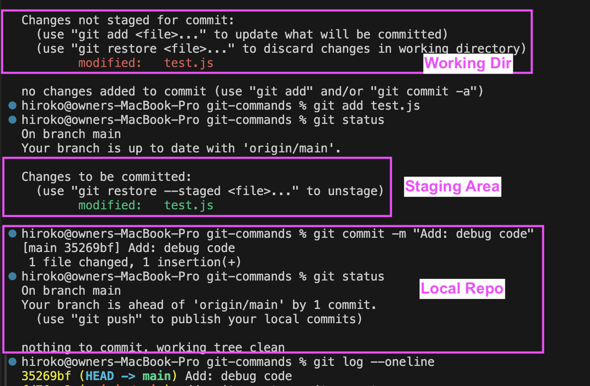
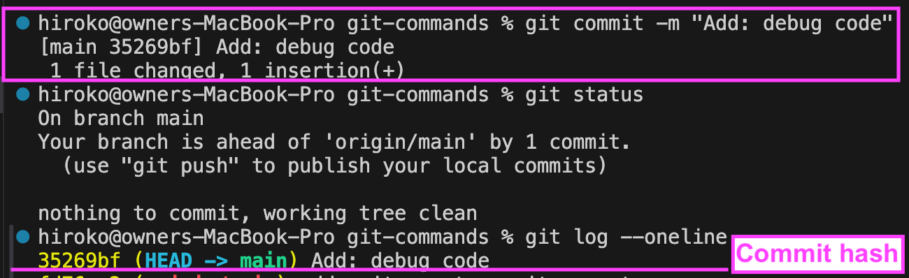
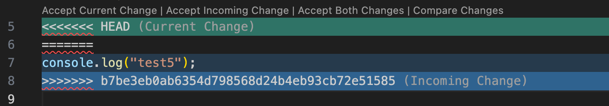
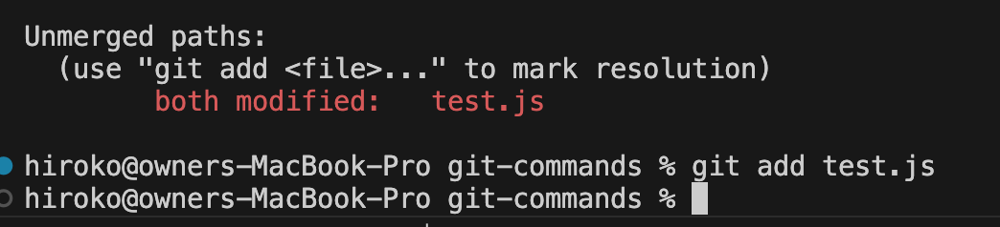
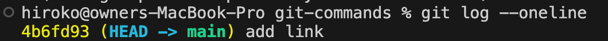
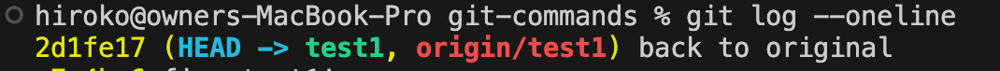
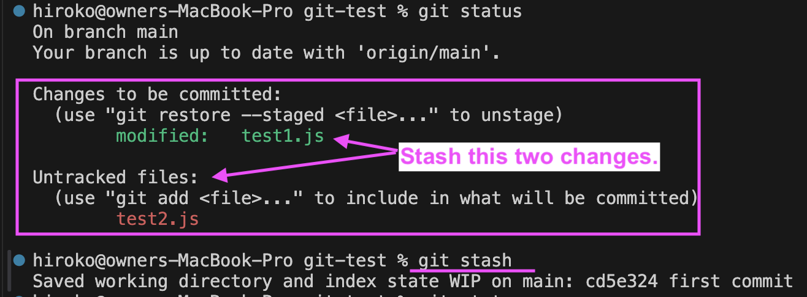
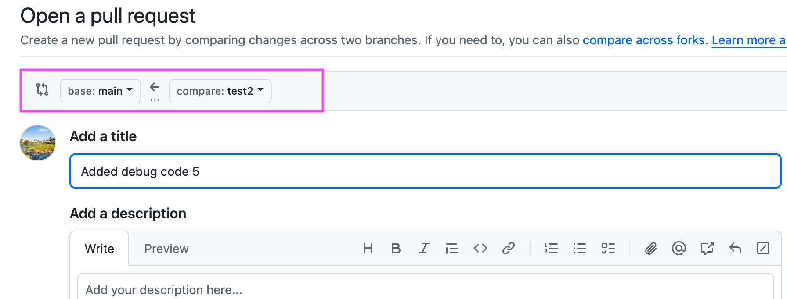
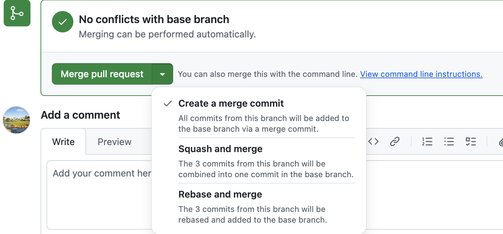

# Git commands

## Four locations

1. Working Directory (unstaged = your local dev env)
2. Staging Area (staged)
3. Local Repository
4. Remote Repository




## git clone

- An existing Remote Repo -> Local Repo.
- Clone a repository into a new directory.
- https://git-scm.com/docs/git-clone

## git add

- Save files from Workind Directory to the staging area to prepare the next commit snapshot.
- Working Directory -> State Area
- https://git-scm.com/docs/git-add

## git commit

- Save changes from Staging Srea to Local Repo with a comment.
- take a snapshot of the staging area and saves it to your local repo.
- A commit hash == a unique identifier
- https://git-scm.com/docs/git-commit
  

## git pull

- To integrate your teammates's work, you use `git pull` which **fetches** changes from remote repository and **merges** them into your local repo.
- Fetch and Merge.
- https://git-scm.com/docs/git-pull


## git fetch vs git pull?

**git fetch:**

- The git fetch command retrieves changes from a remote repository to the local repository.
- but it does not update the working directory or merge any changes into the current branch.
- This means that after fetching, you can review the changes made in the remote repository without affecting your local work.

**git pull**

- fetching changes from a remote repo and merging them into the current your branch in **one step**. Fetch and Merge.

<hr />

## git branch, git checkout -b

```js
git branch --list
git branch new_branch
git checkout -b new_branch //Create a new branch and then checkout the branch.
```

- List, create, or delete branches
- List: `git branch` or `git branch --list`
- Create: `git branch <branchname>`
- Delete: `git branch -D <branchname>`
- Git branching - allows you to diverge from the main codebase to develop a new feature without impacting the main code.
- https://git-scm.com/docs/git-branch

## git rebase -i HEAD~x

- Git rebase is a handy tool to have for creating nice clean history in your git repository
- Ex. Squash 3 commits history to one

```
git log
git rebase -i HEAD~3
pick 1b9d9cb commit 1
pick 9917593 commit 2
pick a571ceb commit 3
------------>Suash commit 2 and 3
pick 1b9d9cb commit 1
squash 9917593 commit 2
squash a571ceb commit 3
:wq!
ESC key
------------> Edit the comment for 3 commits.
# This is a combination of 3 commits.
# This is the 1st commit message:

commit 1

# This is the commit message #2:

#commit 2

# This is the commit message #3:

#commit 3
:wq!
ESC key
------------
```

- https://www.youtube.com/watch?v=AWayLpQHJeE

<!-- ## What is a conflict in Git?

- https://www.youtube.com/watch?v=DloR0BOGNU0

1. `git merge` or `git pull`
2. `git status` - check which files are conflicted.
3. Check the conflict markers.
4. Manually pick the changes either HEAD marker or Incoming marker.
5. Run `git status` again but git doesn't know your change so run `git add` to add the changes to the state area each file.


 -->

## What is HEAD in Git?

- HEAD is a pointer to the current commit on the currently checked-out branch.
  
  

## git status

- Displays the current state of the repository in Git.
- modified, Untracked, new file
- identify which files are staged for the next commit.
- A file in red ===> Unstaged
- A file in green ===> Staged
- https://git-scm.com/docs/git-status

## git reset vs git revert

- Undo a git commit.
- git reset -> Remove git commit history entirely.
- git revert -> add revert history.
- Already pushed ? `git revert` : `git reset`


- https://www.youtube.com/watch?v=GytsxgB4-HU
- Check if already pushed or not.

  `git log --oneline --branches --not --remotes`

**Summary**

```js
git log --oneline
git reset HEAD~1
git reset HEAD~3
git reset 3bde3a5
git revert a649881 //=> Edit a comment => Done! => the commit "a649881" Not Removed!!
```

<!-- ## git checkout .

- Deleted all uncommited changes forever! -->

## git stash

- Takes your uncommitted changes (both staged and unstaged), saves them away.
- It is useful when you want to get the latest remote repo changes into your working directory.
- **unstaged**, **staged**, local repo, remote repo

```js
git stash
git pull origin master
git stash apply
```

- https://git-scm.com/docs/git-stash
  

## Pull Request (PR)

- A pull request is a proposal to merge changes from one branch into another. In a pull request, collaborators can review and discuss the proposed changes before integrating them into the main codebase
- Select `base` branch where you want to merge the curent branch. -> Add the title and description for a PR. -> create pull request.



## PR with a merge conflict

- Merge Conflict occurs when changes made to the same part of the same file on two different branch.

```js
git pull origin main // 1. Update your local main branch.
git switch mybranch // 2. Switch my branch and then merge the change into my branch.
git merge main
//===A merge conflict shows in conflict markers. Fix them manually.
git add .
git commit -m “Resolve merge conflict”
git status
git push origin  mybranch
//===Go to PR again - Merge Conflict is gone.
```


- https://www.youtube.com/watch?v=FDXSgyDGmho
- https://www.youtube.com/watch?v=DloR0BOGNU0

## Pull Request merge options

**Create a merge commit (default)**

- [Git official doc](https://docs.github.com/en/pull-requests/collaborating-with-pull-requests/incorporating-changes-from-a-pull-request/about-pull-request-merges#merge-your-commits)
- All commits from the feature branch are added to the base branch in a merge commit.

**Squash and merge**

- [Git official doc](https://docs.github.com/en/pull-requests/collaborating-with-pull-requests/incorporating-changes-from-a-pull-request/about-pull-request-merges#squash-and-merge-your-commits)
- The pull request's commits are squashed into a single commit.



## git log --all --decorate --graph --oneline

- Shows git history with graphs.
- `A Dog` = `git log --all --decorate --oneline --graph`
  

## References:

- https://www.datacamp.com/blog/git-interview-questions-and-answers
- https://www.youtube.com/watch?v=e9lnsKot_SQ&t=75s
- https://git-scm.com/docs/git-branch
- https://stackoverflow.com/questions/9162271/fatal-not-a-valid-object-name-master
- https://stackoverflow.com/questions/66209755/how-do-i-create-git-branch-and-switch-at-a-time-when-creating-a-branch
- https://stackoverflow.com/questions/2304087/what-is-head-in-git
- https://stackoverflow.com/questions/1057564/pretty-git-branch-graphs
