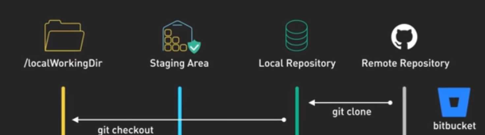

# Git commands

- [Git commands](#git-commands)
  - [Four locations](#four-locations)
  - [Prepare to Commit](#prepare-to-commit)
    - [git add](#git-add)
    - [git restore --staged](#git-restore---staged)
    - [git add \<=\> git restore](#git-add--git-restore)
    - [git status](#git-status)
  - [Make Commits](#make-commits)
    - [git commit](#git-commit)
    - [git reset HEAD~1](#git-reset-head1)
    - [git commit --amend](#git-commit---amend)
  - [fetch vs merge vs pull](#fetch-vs-merge-vs-pull)
    - [fetch, merge, pull](#fetch-merge-pull)
    - [git push](#git-push)
    - [git diff](#git-diff)
  - [Branch](#branch)
    - [git branch](#git-branch)
    - [git branch xxx](#git-branch-xxx)
    - [git checkout -b new-branch](#git-checkout--b-new-branch)
  - [Discard Your Changes](#discard-your-changes)
    - [git stash](#git-stash)
    - [git clone](#git-clone)
  - [merge vs rebase](#merge-vs-rebase)
    - [git merge (preserve history)](#git-merge-preserve-history)
    - [git rebase](#git-rebase)
  - [git rebase vs git rebase -i (interactive rebase)](#git-rebase-vs-git-rebase--i-interactive-rebase)
    - [git rebase | git rebase -i](#git-rebase--git-rebase--i)
    - [git rebase -i \[branch\]](#git-rebase--i-branch)
    - [A linear history](#a-linear-history)
  - [History](#history)
    - [git log --oneline --graph](#git-log---oneline---graph)
  - [Misc](#misc)
    - [Merge conflict](#merge-conflict)
    - [What is HEAD in Git?](#what-is-head-in-git)
    - [When does main get a linear history?](#when-does-main-get-a-linear-history)
  - [screenshot](#screenshot)
  - [Reference](#reference)

## Four locations

1. Working Directory: File you edit, can be unstaged or staged.
2. Staging Area: Changes marked for the next commit, git add
3. Local Repository (.git): the hidden .git database that stores all commits, branches, and history on your machine.
4. Remote Repository (GitHub)

```bash
Working Directory
   ↓ git add
   ↑ git restore
Staging Area
   ↓ git commit
   ↑ git reset HEAD
Local Repository
```

- Unstage == Keep file changes
- **The local repository** is the **hidden .git database** that stores all commits, branches, and history on your machine.

```
Q: How to “see” the local repository. See commits.
A: git log --oneline
```

```
Q: How to “see” the local repository. See branches (local repository)
A: git branch
```

---

## Prepare to Commit

### git add

- Save changes to the staging area for the next commit.
- Working Directory ==> State Area

### git restore --staged

- Unstage a file
  ```bash
  git add xxx→ stage a file
  git restore --staged xxx → unstage a file
  ```

### git add <=> git restore

- stage changes <=> unstage changes

### git status

- show current repository state, staged vs unstaged changes.
- Red → unstaged
- Green → staged

---

## Make Commits

### git commit

- Save staged changes to the local repository.

### git reset HEAD~1

- Undo commit and unstaged

```bash
git add → stage changes
git restore --staged → unstage changes
git commit → save staged changes
git reset --soft → undo commit, keep staged
git reset → undo commit, keep unstaged
```

### git commit --amend

- Edit the latest commit message

---

## fetch vs merge vs pull

### fetch, merge, pull

- `git fetch` → download remote updates TO `remote-tracking branches` (==NO visible changes)
- `git merge` → merge another branch into the current branch.
- `git pull` → fetch + merge (automatic)
- Fetch is like checking the menu.
- Merge is like ordering the food 🍔
- `origin/main` ==> local, read-only references of the remote main branch. (== remote-tracking branches)
- `origin/feature-test` ==> local, read-only references of the remote feature-test branch. (==remote-tracking branches)

```bash
// I am main branch.
git fetch origin 					# update remote-tracking branches
git diff main origin/feature-test	# preview changes before merge
git merge origin/feature-test		# apply changes to main
```

### git push

- upload local commits to the remote repository

### git diff

- show changes in working directory vs staging area

---

## Branch

```bash
# summary (Branch)
git branch: List all local branches.
git branch xxx: Create a new branch.
git checkout -b new-branch: Create a new branch and switch to it.
```

### git branch

- List all local branches

### git branch xxx

- Create a new branch (does not switch to it)

### git checkout -b new-branch

- Create a new branch and switch to it immediately

---

## Discard Your Changes

### git stash

- temporarily save uncommitted changes to reapply later

```bash
git stash
git pull origin master
git stash apply
```

### git clone

- Copy a remote repository to a local directory

```bash
# Summary
git stash : temporarily save uncommitted changes to reapply later.
git stash apply:
```

---

## merge vs rebase

### git merge (preserve history)

- **git merge** combines another branch into your current branch by creating a new merge commit that preserves both histories.

```bash
git merge develop
A — B — C ──┐
       \    M  (my-branch)
        D — E
```

- M = merge commit
- D and E keep their original hashes
- History is non-linear
- No history rewriting
- ✅ Creates 1 new merge commit

### git rebase

- git rebase rewrites commit history by replaying commits on top of another base commit, creating a linear history.

```bash
git rebase develop
A — B — C — D' — E'  (my-branch)
```

- D → D'
- E → E'
- No merge commit
- Commits are replayed on top of C
- Commit hashes change
- ✅ Creates new commits, but not a merge commit

---

## git rebase vs git rebase -i (interactive rebase)

### git rebase | git rebase -i

- **Normal rebase is for syncing code; interactive rebase is for cleaning history.**

```bash
git rebase develop: syncing code
git rebase -i [branch]:interactive rebase is for cleaning history before pushing / opening PR
```

**Flow**

```bash
# Update develop
1. git checkout develop
2. git pull origin develop
# Switch to your feature branch
3. git checkout my-branch
4. git rebase develop ## git merge vs git rebase
### !!! If conflicts happen → fix them, then:
5. git add .
6. git rebase --continue
### Then, I keep working on my-branch to complete my tasks.
7. git rebase -i develop ## interactive rebase to edit your own commits (squash, reorder, rename) on top of develop.
8. git push origin my-branch --force-with-lease
```

```bash
## Before rebase
A — B — C  (develop)
       \
        D  (feature1)
## After rebase
A — B — C — D'  (feature1)
```

### git rebase -i [branch]

- interactive rebase is for cleaning history before pushing / opening PR

```bash
pick 0a2a79e test 2/11 ## Keep a first commit
squash 36d7e81 commit test 2 # squash
squash fb0cf39 commit test -3 # squash
OR
pick 0a2a79e test 2/11 ## Keep a first commit
s 36d7e81 commit test 2 # squash
s fb0cf39 commit test -3 # squash
// Escape wq!
// Add one clean commit
```

### A linear history

To get a linear history, teams usually require:

- rebase (not merge)
- squash feature commits
- fast-forward merges only

---

## History

### git log --oneline --graph

- Show commit history with graph

```bash
git log --oneline → compact commit history
git log --oneline --graph → commit history with graph
```

## Misc

### Merge conflict

- Merge Conflict occurs when changes made to the same part of the same file on two different branch.
- Resolve by checking the conflict markers (HEAD for current branch, incoming branch markers) and fixing manually.

### What is HEAD in Git?

- pointer to the current commit on the checked-out branch.

### When does main get a linear history?

```bash
git checkout develop
git merge feature1

# A — B — C — D'  (develop)
```

## screenshot



## Reference

- https://git-scm.com/docs/git
- https://git-scm.com/cheat-sheet#make-commits
