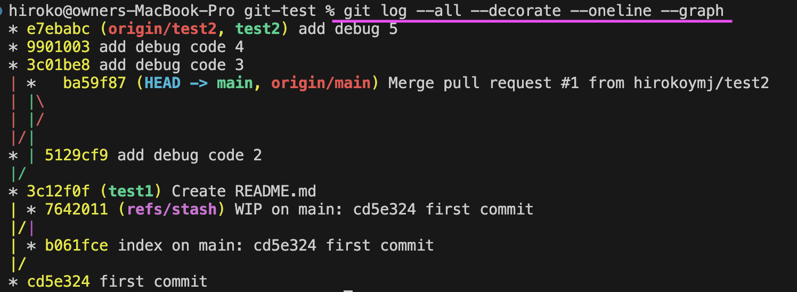

# Git commands xxx yyyzzz

## Four locations

1. Working Directory: File you edit, can be unstaged or staged.
2. Staging Area (index): Changes marked for the next commit, git add
3. Local Repository (.git): the hidden .git database that stores all commits, branches, and history on your machine.
4. Remote Repository (GitHub)

```bash
Working Directory
   ↓ git add
   ↑ git restore
Staging Area
   ↓ git commit
   ↑ git reset HEAD
Local Repository
```

- Unstage == Keep file changes
- The local repository is the hidden .git database that stores all commits, branches, and history on your machine.

Q: How to “see” the local repository. See commits.
A: `git log --oneline`

Q: How to “see” the local repository. See branches (local repository)
A: `git branch`

## git fetch | git merge | git pull

- `git fetch` → download remote updates (==invisible the changes)
- `git fetch` → download remote updates TO `remote-tracking branches` (==NO visible changes)
- `git merge` → change your branch
- `git pull` → fetch + merge (automatic)
- Fetch is like checking the menu.
- Merge is like ordering the food 🍔
- `origin/main` ==> local, read-only references of the remote main branch. (== remote-tracking branches)
- `origin/feature-test` ==> local, read-only references of the remote feature-test branch. (==remote-tracking branches)

```bash
// I am main branch.
git fetch origin 					# update remote-tracking branches
git diff main origin/feature-test	# preview changes before merge
git merge origin/feature-test		# apply changes to main
```

## git add

- Save changes to the staging area for the next commit
- Working Directory -> State Area

## git restore --staged filename

- Unstage a file
  ```bash
  git add xxx→ stage a file
  git restore --staged xxx → unstage a file
  ```

## git commit

- Save staged changes to the local repository.

## git reset HEAD~1

- Undo commit and unstaged

```bash
git add → stage changes
git restore --staged → unstage changes
git commit → save staged changes
git reset --soft → undo commit, keep staged
git reset → undo commit, keep unstaged
```

## git clone

- Copy a remote repository to a local directory

## git pull

- fetch + merge (automatic)
- fetch and merge remote changes into the current branch

## git push

- upload local commits to the remote repository

## git branch

- List all local branches

## git branch xxx

- Create a new branch (does not switch to it)

## git checkout -b new-branch

- Create a new branch and switch to it immediately

## git status

- show current repository state, staged vs unstaged changes.
- Red → unstaged
- Green → staged

## git diff

- show changes in working directory vs staging area

## git stash

- temporarily save uncommitted changes to reapply later

```bash
git stash
git pull origin master
git stash apply
```

## git commit --amend

- Edit the latest commit message

## Merge conflict

- Merge Conflict occurs when changes made to the same part of the same file on two different branch.
- Resolve by checking the conflict markers (HEAD for current branch, incoming branch markers) and fixing manually.

## git rebase -i HEAD~x

- squash multiple commits into one
- squash these 3 commits into 1. `git rebase -i HEAD~3`

```bash
pick 0a2a79e test 2/11 ## Keep a first commit
squash 36d7e81 commit test 2 # squash
squash fb0cf39 commit test -3 # squash
OR
pick 0a2a79e test 2/11 ## Keep a first commit
s 36d7e81 commit test 2 # squash
s fb0cf39 commit test -3 # squash
// Escape wq!
// Add one clean commit
```

## What is HEAD in Git?

- pointer to the current commit on the checked-out branch.

## screenshots


## A linear history

```bash
A — B — C — D
```

```bash
A — B — C — M
        \   /
         D — E
```

To get a linear history, teams usually require:

- rebase (not merge)
- squash feature commits
- fast-forward merges only

```bash
# Update develop
git checkout develop
git pull origin develop
# Switch to your feature branch
git checkout my-branch
git rebase develop # If conflicts happen → fix them, then:

git add .
git rebase --continue
git rebase -i develop


pick a1b2c3 commit 1
pick d4e5f6 commit 2
pick g7h8i9 commit 3

pick a1b2c3 commit 1
s d4e5f6 commit 2
s g7h8i9 commit 3
# Edit the final commit message → save → exit.
git push origin my-branch --force-with-lease
```

## git log --all --decorate --graph --oneline

- Shows git history with graphs.
- `A Dog` = `git log --all --decorate --oneline --graph`
  

## References:

- https://www.datacamp.com/blog/git-interview-questions-and-answers
- https://www.youtube.com/watch?v=e9lnsKot_SQ&t=75s
- https://git-scm.com/docs/git-branch
- https://stackoverflow.com/questions/9162271/fatal-not-a-valid-object-name-master
- https://stackoverflow.com/questions/66209755/how-do-i-create-git-branch-and-switch-at-a-time-when-creating-a-branch
- https://stackoverflow.com/questions/2304087/what-is-head-in-git
- https://stackoverflow.com/questions/1057564/pretty-git-branch-graphs
